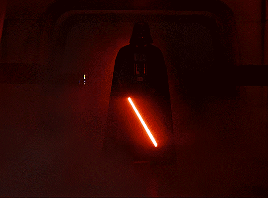

<table>
<tr>
<td width="65%">

<h1>Hi 👋, I'm Mohamed Abdelhady</h1>

<b>Software Engineering Student • Backend Developer • Competitive Programmer</b>

  

Passionate about Algorithms, Data Structures, Backend Engineering, Operating Systems, Mathematics, and Building Scalable Software.

  

🎯 Currently focusing on:

* Backend Engineering
* Competitive Programming
* Open Source
* System Design

</td>

<td width="35%">

</td>
</tr>
</table>

---

### 🛠 Tech Stack

  

---

### 🌐 Connect With Me

  

  

  

  

  

  

  

---

### 📊 GitHub Statistics

  
  

  

---

  <i>Code • Build • Learn • Repeat</i>

